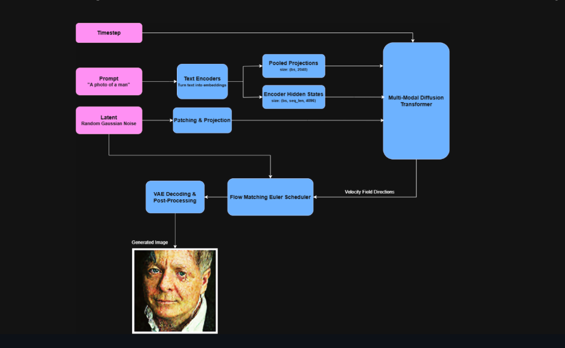

# DiffusionX: Hardware-Accelerated Inference Engine

*A hardware-aware diffusion inference engine with custom scheduler, CFG and performance profiling.*

DiffusionX focuses on bridging ML theory and systems engineering by optimizing Stable Diffusion inference across hardware and workload configurations.

## Quick Start ⚡
```bash
pip install -r requirements.txt
python src/main.py --prompt "a cyberpunk city"
```

## Key Metrics 🚀

- **Throughput**: Up to 2.4 images/sec (batch=4, high_perf)
- **Latency Reduction**: ~20% execution speedup via `torch.compile`
- **Memory Reduction**: ~45% peak-VRAM reduction using CPU offloading and VAE slicing

## Demo Output 🖼️

*(Below is an illustrative output generated from `python src/main.py --prompt "A photo of a man" --seed 42`)*  


## System Architecture



```text
Prompt → [Text Encoder] → [CFG Batched Latents] → [torch.compiled UNet] → [DiffusionScheduler] → [VAE Slicer] → Final Image
```

```text
DiffusionXEngine
 ├── Model Loader
 ├── Custom Sampler
 ├── Optimization Layer
 │    ├── Compile (torch.compile)
 │    ├── Precision (Mixed Precision / VAE Slicing)
 │    ├── Offloading (CPU Sequential / Model Offload)
 │
 ├── Benchmarking Layer
 │    ├── Latency Profiling
 │    ├── Throughput Tracking
 │    ├── Memory Monitoring
 │
 └── Reporting Layer
      ├── Scaling Graphs
      ├── Convergence Tables
      ├── Optimization Impact Reports
```

## Architectural Ablation Study

| Feature | Impact & Purpose |
|---------|-----------------|
| **+ Classifier-Free Guidance (CFG)** | Enforces strict prompt alignment. Optimized by batching conditional & unconditional inputs. |
| **+ Custom DDPM Scheduler** | Re-implemented core $x_0$ unrolling math natively, dropping library abstraction overhead for total timestep control. |
| **+ Batching** | Vastly increases processing **throughput (img/sec)** at the direct cost of steep localized VRAM consumption. |
| **+ `torch.compile`** | Significant **latency** reduction per step during inference loops, paid upfront by JIT warmup penalties. |

## Features

- **Dynamic Hardware Profiling**: Automatically assigns `low_vram`, `balanced`, or `high_perf` based on auto-detected hardware via `src/optimization/hardware.py`.
- **Custom DDPM Scheduler**: Includes a standalone, manually unrolled Diffusion Scheduler solving iterative reconstruction of $x_0$ decoupled from standard diffusers library abstractions.
    - *Core Mechanics* : Iteratively updates latent images with standard inverse probability mappings: $x_{t-1} = \sqrt{\bar{\alpha}_{t-1}} x_0 + \sqrt{1 - \bar{\alpha}_{t-1}} \epsilon_\theta(x_t, t)$
- **Classifier-Free Guidance (CFG)**: Implemented CFG natively in the sampling loop by concatenating conditional and unconditional predictions to drastically improve prompt alignment, while optimizing matrix operations via single-batch forwarding.
- **Benchmark Matrix**: Tests `[Schedulers] x [Steps] x [Batch Sizes]` and reports latency, throughput (img/sec), and memory footprint.
- **Reporting System**: Generates matplotlib visualizations to help data-driven optimization choices.

## Benchmarking Results 📊

We evaluated multiple schedulers across step counts and batch sizes.

**Key Insights:**
- DDIM offers faster inference with slightly reduced generative quality at extremely low step thresholds.
- Euler provides a strong balance between speed and quality across most consumer setups.
- **Throughput Scales with Batch Size** linearly until hitting the VRAM bottleneck, at which point the PCIe allocation spikes latency.

## Usage

Run an optimized inference with customizable steps, batch sizes, and explicitly enforced profiles:
```bash
python src/main.py --prompt "A futuristic cityscape, highly detailed" --steps 30 --batch 2 --optimize high_perf
```

Run the systematic benchmarking suite:
```bash
python src/main.py --benchmark
```

## Failure Analysis & Technical Tradeoffs ⚠️

Building production deep learning engines requires managing strict constraints. Here is the breakdown of engineering tradeoffs and limits identified in DiffusionX:

- **`torch.compile`**: 
  - *Benefit*: Noticeably faster runtime iteration and latency reduction.
  - *Tradeoff*: Induces a significant JIT compilation penalty on startup. Best suited for high-throughput batching or persistent API endpoints.
- **Batching & OOM Cascade**:
  - *Failure Point*: Setting `--batch 8` on 12GB VRAM cards causes instantaneous CUDA OOM.
  - *Tradeoff*: Scales VRAM requirements almost linearly. Can OOM standard GPUs if batch sizes outgrow hardware memory limits. Mitigation requires smaller active batching.
- **CPU Offloading & VAE Slicing**:
  - *Benefit*: Radically lowers peak VRAM footprint, allowing high-resolution inference on consumer GPUs.
  - *Tradeoff*: PCIe inter-bus communication creates massive bottlenecks lowering throughput significantly.
- **Step Count Degradation**:
  - *Failure Point*: Dropping below `--steps 10` uniformly generates chaotic structural noise overriding coherent subject formation (prompt-destruction).

## Local Setup

See the **Quick Start** section at the top to immediately get generating!
